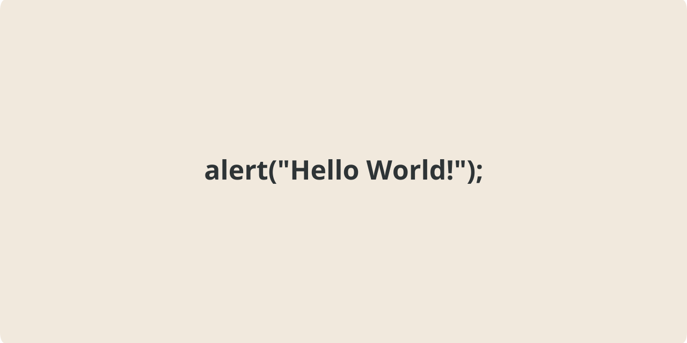

<!-- About v.1.4.0 -->
<!-- Logo: oval - inspired by Patreon new logo, before that it was a circle. -->

<!---->
<picture>
  <source media="(prefers-color-scheme: dark)" srcset="/github-profile-banner-dark.png">
  <source media="(prefers-color-scheme: light)" srcset="/github-profile-banner-light.png">
  
</picture>

# 👤 About:  

👋 Hello.  
🌱 I’m currently learning JavaScript and how to use GitHub.  
👍 I like web design and coding.  
> ⚡ Fun fact: Tim Berners-Lee invented the World Wide Web while working at CERN in 1989 - [Wikipedia](https://en.wikipedia.org/wiki/History_of_the_World_Wide_Web)

---
  
## 🐞 Debug:
**🎨 CSS:**  
`.class { border 1px solid red; }`  

  
**📜 JavaScript:**  
`alert("test");`  
`console.log("test");`  
`console.table("test");`  

---
  
## 📄 Doc.
  
🔗 [MDN Web Docs](https://developer.mozilla.org/)  
🔗 [W3Schools](https://www.w3schools.com/)  
🔗 [Web.dev](https://web.dev/)
  
---
  
> [!NOTE]
> - [Markdown Syntax](https://docs.github.com/github/writing-on-github/getting-started-with-writing-and-formatting-on-github/basic-writing-and-formatting-syntax)  
> - This about page was built using [GitHub](https://github.com/)  
  
---
  
### 🏷️ Speed dial (GitHub explore):  
[#GitHub Profile](https://github.com/topics/github-profile?s=updated),
[#Profile](https://github.com/topics/profile?s=updated),
[#Website](https://github.com/topics/website?s=updated),
[#HTML](https://github.com/topics/HTML?s=updated),
[#CSS](https://github.com/topics/css?s=updated),
[#JavaScript](https://github.com/topics/javascript?s=updated),
[#Game](https://github.com/topics/game?s=updated),
[#App](https://github.com/topics/app?s=updated),
  

<!--
** is a ✨ _special_ ✨ repository because its `README.md` (this file) appears on your GitHub profile.

- ⚡ Fun fact: "Tim Berners-Lee invented the World Wide Web while working at CERN in 1989"

- 🔭 I’m currently working on ...
- 🌱 I’m currently learning ...
- 👯 I’m looking to collaborate on ...
- 🤔 I’m looking for help with ...
- 💬 Ask me about ...
- 📫 How to reach me: ...
- 😄 Pronouns: ...
- ⚡ Fun fact: ...
-->

