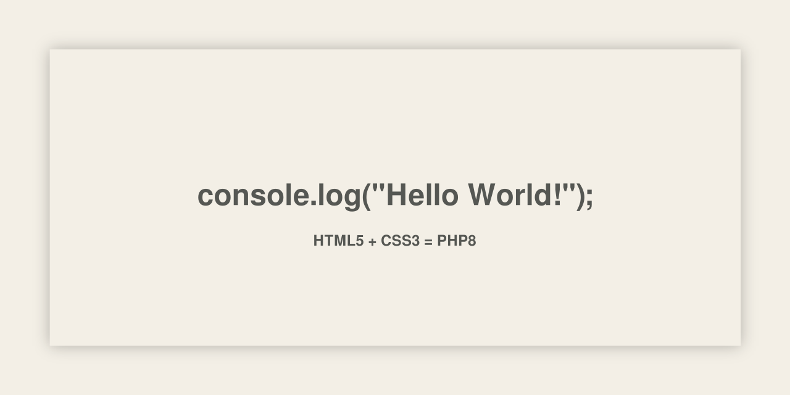

<!-- About v.1.2.1 -->

# ℹ️ About:  

👋 Hello.  
🌱 I’m currently learning JavaScript and how to use GitHub.  
👍 I like web design, web development, and coding.

## 🐞 Debug:
- **🎨 CSS:**
- `.class { border 1px solid red; }`
- **📜 JavaScript:**
- `alert("test");`
- `console.log("test");`
- `console.table("test");`

## ⭐ Speed dial:
[#website](https://github.com/topics/website?s=updated),
[#Portfolio](https://github.com/topics/portfolio?s=updated),
[#JavaScript](https://github.com/javascript/javascript?s=updated),
[#CSS](https://github.com/topics/css?s=updated),
[#Game](https://github.com/topics/game?s=updated),
[#App](https://github.com/topics/app?s=updated),
  
## 🏷️ Tags:
[#Profile](https://github.com/topics/profile?s=updated),
[#Template](https://github.com/topics/template?s=updated),
[#GitHub Profile](https://github.com/topics/github-profile?s=updated),
[#Config](https://github.com/topics/config?s=updated),
[#GitHub Config](https://github.com/topics/github-config?s=updated),
[#Profile Readme](https://github.com/topics/profile-readme?s=updated),
[#GitHub Profile Readme](https://github.com/topics/github-profile-readme?s=updated),
  
---
  
> [!NOTE]
> [Markdown Syntax](https://docs.github.com/github/writing-on-github/getting-started-with-writing-and-formatting-on-github/basic-writing-and-formatting-syntax) 
  

<!--
** is a ✨ _special_ ✨ repository because its `README.md` (this file) appears on your GitHub profile.

Here are some ideas to get you started:

- 🔭 I’m currently working on ...
- 🌱 I’m currently learning ...
- 👯 I’m looking to collaborate on ...
- 🤔 I’m looking for help with ...
- 💬 Ask me about ...
- 📫 How to reach me: ...
- 😄 Pronouns: ...
- ⚡ Fun fact: ...
-->

